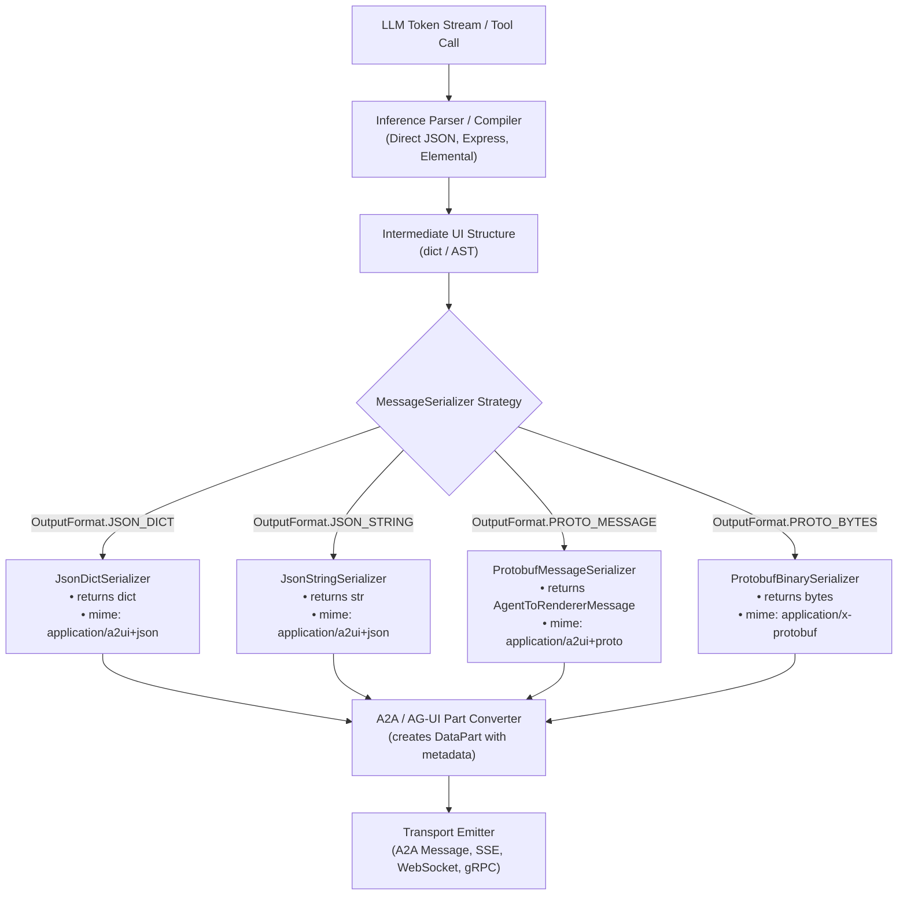

# Python Agent SDK Selectable Output Format Architecture

## Title and metadata

- **Title**: Python Agent SDK Selectable Output Format Architecture
- **Author**: A2UI Team
- **Date**: 2026-08-20
- **Status**: Draft
- **Target audience**: SDK maintainers, Agent framework developers, Client application engineers

## Executive summary

The A2UI Python Agent SDK currently emits user interface payloads exclusively as standard Python dictionaries or JSON strings with MIME type `application/a2ui+json`. With the addition of canonical Protocol Buffers (Protobuf) schema definitions under `specification/v1_0/proto` conforming to Protobuf Editions (`edition = "2023"`), developers need the option to emit strongly-typed Protobuf message instances (`AgentToRendererMessage`) and binary Protobuf payloads (`application/a2ui+proto` / `application/x-protobuf`).

This proposal introduces a pluggable output serialization architecture for the Python Agent SDK. Developers can choose their target format (`json_dict`, `json_string`, `proto_message`, `proto_bytes`) when configuring agent toolsets, converters, and transport pipelines without altering underlying inference formats or prompt generators.

## Problem statement and context

The A2UI Python Agent SDK (`a2ui_agent`) translates LLM outputs into structured UI commands sent to client applications. Today, these operations produce untyped Python dictionaries representing JSON envelopes (`createSurface`, `updateComponents`, `updateDataModel`, etc.).

While JSON provides human-readability and dynamic flexibility, production systems often require:

1. **Compile-time type safety**: Ensuring messages constructed by agent logic conform to schemas prior to wire transmission.
2. **Wire efficiency**: Transmitting compact binary Protobuf streams rather than verbose JSON strings over high-throughput connections (gRPC, WebSockets, A2A).
3. **Multi-transport flexibility**: Supporting diverse client capabilities where some endpoints consume JSON while others require binary Protobuf.

The SDK requires an extensible architecture that accommodates Protobuf outputs while retaining full backward compatibility for existing JSON workflows.

## Goals and non-goals

### Goals

- Support emitting strongly-typed Protobuf message instances (`AgentToRendererMessage`) and binary wire payloads from the Python Agent SDK.
- Provide a unified `OutputFormat` selection API across agent toolsets (`SendA2uiToClientToolset`), part converters (`A2uiPartConverter`), and response parsers.
- Standardize MIME types across transport boundaries (`application/a2ui+json`, `application/a2ui+proto`, `application/x-protobuf`).
- Maintain 100% backward compatibility for existing applications using dictionary-based JSON outputs.

### Non-goals

- Modifying upstream LLM prompt formats or inference formats (LLMs continue generating text, JSON, or DSL tokens; serialization occurs post-parsing).
- Enforcing Protobuf output in non-Python SDKs (TypeScript and Dart SDKs manage their own language-specific bindings).
- Replacing JSON Schema validation for renderers that only implement JSON transport endpoints.

## Proposed architecture

The architecture decouples the intermediate representation of parsed UI messages from wire serialization using the Strategy design pattern.



### Component Roles

1. **Inference Parser / Compiler**: Parses raw LLM output into an intermediate Python representation.
2. **`MessageSerializer`**: Strategy interface converting the intermediate representation into the requested output format.
3. **Protobuf Bindings (`a2ui.proto.v1_0`)**: Generated Python code compiled from the canonical `.proto` specifications.
4. **Part Converter (`A2uiPartConverter`)**: Packages the serialized payload into an A2A `DataPart` with appropriate MIME type metadata.

## Detailed design

### 1. Protobuf Bindings Generation

Protobuf definitions from `specification/v1_0/proto` and `specification/v1_0/catalogs/basic` are compiled into `agent_sdks/python/a2ui_agent/src/a2ui/proto/v1_0/`:

```bash
protoc \
  --proto_path=specification/v1_0/proto \
  --proto_path=specification/v1_0/catalogs/basic \
  --python_out=agent_sdks/python/a2ui_agent/src/a2ui/proto/v1_0 \
  --pyi_out=agent_sdks/python/a2ui_agent/src/a2ui/proto/v1_0 \
  specification/v1_0/proto/*.proto \
  specification/v1_0/catalogs/basic/*.proto
```

### 2. Output Format Enum & Serializer Interface

```python
from abc import ABC, abstractmethod
from enum import Enum
from typing import Any, Union
from google.protobuf import json_format
from a2ui.proto.v1_0 import agent_to_renderer_pb2

class OutputFormat(Enum):
    """Supported output serialization formats."""
    JSON_DICT = "json_dict"          # Raw Python dict
    JSON_STRING = "json_string"      # Serialized JSON string
    PROTO_MESSAGE = "proto_message"  # AgentToRendererMessage object instance
    PROTO_BYTES = "proto_bytes"      # Serialized binary Protobuf bytes

class MessageSerializer(ABC):
    """Abstract strategy for serializing A2UI message payloads."""
    
    @property
    @abstractmethod
    def mime_type(self) -> str:
        """The MIME type associated with the output format."""
        pass

    @abstractmethod
    def serialize(self, payload: dict[str, Any]) -> Any:
        """Serializes an A2UI dictionary payload into the target format."""
        pass
```

### 3. Concrete Serializers

```python
import json

class JsonDictSerializer(MessageSerializer):
    @property
    def mime_type(self) -> str:
        return "application/a2ui+json"

    def serialize(self, payload: dict[str, Any]) -> dict[str, Any]:
        return payload

class JsonStringSerializer(MessageSerializer):
    @property
    def mime_type(self) -> str:
        return "application/a2ui+json"

    def serialize(self, payload: dict[str, Any]) -> str:
        return json.dumps(payload)

class ProtobufMessageSerializer(MessageSerializer):
    @property
    def mime_type(self) -> str:
        return "application/a2ui+proto"

    def serialize(self, payload: dict[str, Any]) -> agent_to_renderer_pb2.AgentToRendererMessage:
        message = agent_to_renderer_pb2.AgentToRendererMessage()
        json_format.ParseDict(payload, message, ignore_unknown_fields=False)
        return message

class ProtobufBinarySerializer(MessageSerializer):
    @property
    def mime_type(self) -> str:
        return "application/x-protobuf"

    def serialize(self, payload: dict[str, Any]) -> bytes:
        message = agent_to_renderer_pb2.AgentToRendererMessage()
        json_format.ParseDict(payload, message, ignore_unknown_fields=False)
        return message.SerializeToString()
```

### 4. Integration with `A2uiPartConverter` & `create_a2ui_part`

Update `create_a2ui_part` to attach the appropriate metadata based on the payload format:

```python
def create_a2ui_part(
    a2ui_data: Union[dict[str, Any], agent_to_renderer_pb2.AgentToRendererMessage, bytes],
    output_format: OutputFormat = OutputFormat.JSON_DICT,
    version: Optional[str] = None,
) -> Part:
    """Creates an A2A Part containing A2UI data formatted according to output_format."""
    if output_format == OutputFormat.PROTO_MESSAGE:
        return Part(
            root=DataPart(
                data=a2ui_data,
                metadata={MIME_TYPE_KEY: "application/a2ui+proto"},
            )
        )
    elif output_format == OutputFormat.PROTO_BYTES:
        return Part(
            root=DataPart(
                data=a2ui_data,
                metadata={MIME_TYPE_KEY: "application/x-protobuf"},
            )
        )
    
    # Default JSON dict
    mime_type = "application/a2ui+json"
    if version in ("0.8", "0.9", "v0.8", "v0.9"):
        mime_type = "application/json+a2ui"
        
    return Part(
        root=DataPart(
            data=a2ui_data,
            metadata={MIME_TYPE_KEY: mime_type},
        )
    )
```

Update `A2uiPartConverter` to accept `output_format`:

```python
class A2uiPartConverter:
    def __init__(
        self,
        a2ui_catalog: A2uiCatalog,
        bypass_tool_check: bool = False,
        fallback_text: Optional[str] = None,
        version: str = constants.VERSION_1_0,
        parser: Optional[Parser] = None,
        output_format: OutputFormat = OutputFormat.JSON_DICT,
    ):
        self._catalog = a2ui_catalog
        self._bypass_tool_check = bypass_tool_check
        self._fallback_text = fallback_text
        self._version = version
        self._parser = parser or DirectJsonParser(a2ui_catalog, validator=a2ui_catalog.validator)
        self._output_format = output_format
        self._serializer = get_serializer(output_format)
```

### 5. Developer Configuration Example

Developers configure output format directly on the agent toolset:

```python
from a2ui.adk.send_a2ui_to_client_toolset import SendA2uiToClientToolset
from a2ui.serializer import OutputFormat
from google.adk.agents import LlmAgent

# Agent configured to emit Protobuf instances
proto_agent = LlmAgent(
    name="proto_agent",
    tools=[
        SendA2uiToClientToolset(
            a2ui_enabled=True,
            a2ui_catalog=catalog,
            a2ui_examples=examples,
            output_format=OutputFormat.PROTO_MESSAGE,
        )
    ],
)
```

## Alternatives considered

1. **Unconditional Global Protobuf Migration**:
   - *Description*: Replace all JSON dictionary representations with Protobuf across the entire SDK.
   - *Why rejected*: Breaks compatibility with web renderers, debugging inspection tools, and standard JSON-based transport layers.

2. **Separate Parallel Toolsets (`SendA2uiJsonToolset` vs `SendA2uiProtoToolset`)**:
   - *Description*: Provide distinct tool classes for each serialization format.
   - *Why rejected*: Duplicates validation, prompt injection, and catalog management logic across multiple classes.

3. **Dynamic Reflection Without Precompiled Protos**:
   - *Description*: Use dynamic proto reflection to construct messages at runtime without building `*_pb2.py` files.
   - *Why rejected*: Prevents static type analysis, IDE autocompletion, and increases runtime overhead.

## Risks and mitigations

- **Dependency Management**:
  - *Risk*: Introducing `protobuf` library dependency to lightweight environments.
  - *Mitigation*: The `protobuf` package is a lightweight standard dependency already present in most GenAI and ADK runtime environments.
- **Handling Unknown Extension Fields**:
  - *Risk*: `json_format.ParseDict` could fail on custom vendor metadata if strict checking is enabled.
  - *Mitigation*: The `.proto` schemas explicitly include `google.protobuf.Struct extensions = 1;` in metadata containers, and custom fields map into the `properties` struct.
