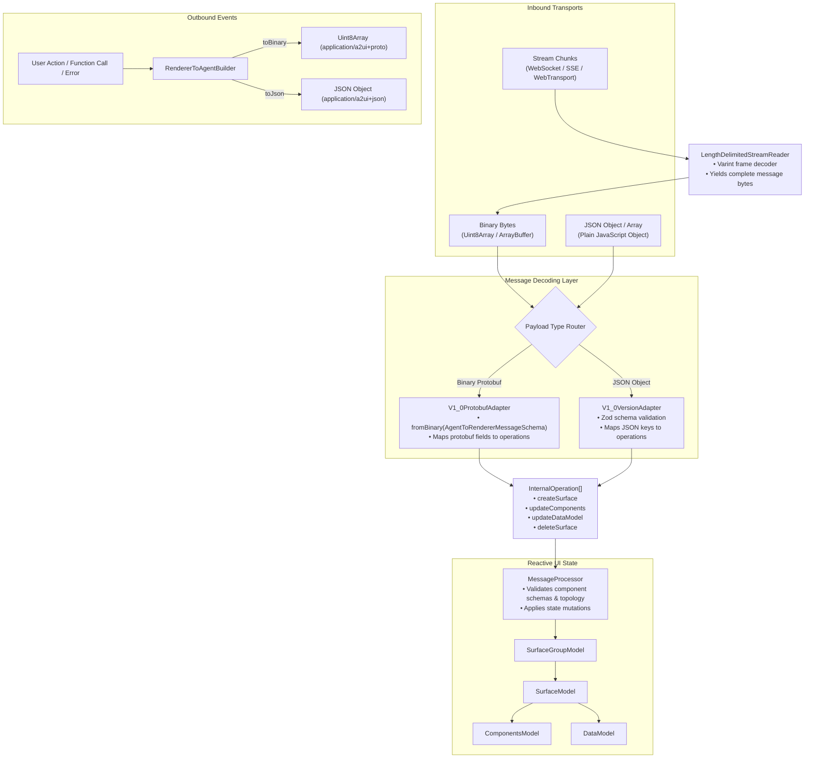

# A2UI Protobuf Ingestion and Parsing Architecture in `web_core`

## Title and metadata

- **Title**: A2UI Protobuf Ingestion and Parsing Architecture in `web_core`
- **Author**: A2UI Team
- **Date**: 2026-08-20
- **Status**: Draft
- **Target audience**: Frontend engineers, Web and native renderer developers, TypeScript SDK maintainers

## Executive summary

The `typescript/web_core` library provides the core headless renderer engine for A2UI. It processes incoming messages, validates component composition rules, manages two-way data binding, and maintains reactive UI state models (`SurfaceGroupModel`, `SurfaceModel`, `ComponentModel`). Currently, `web_core` operates exclusively on JavaScript objects and JSON payloads.

This document defines the architectural design for integrating Protocol Buffers (Protobuf Editions 2023) parsing, binary decoding, streaming varint frame processing, and outbound event encoding into `typescript/web_core`. The architecture allows `MessageProcessor` to accept binary Protobuf payloads (`Uint8Array`, `ArrayBuffer`), length-prefixed binary streams, or typed message instances alongside existing JSON payloads without altering downstream component rendering or state management.

## Problem statement and context

A2UI messages are transported over various network channels including Server-Sent Events (SSE), WebSockets, WebTransport, and gRPC-Web. In high-frequency interactive sessions or applications rendering large component trees, JSON text parsing incurs performance and memory overhead.

With the standardization of canonical Protobuf schema definitions in `specification/v1_0/proto` conforming to Protobuf Editions (`edition = "2023"`), client renderer libraries need to ingest binary Protobuf messages directly.

The `typescript/web_core` library needs to:

1. **Decode binary Protobuf envelopes directly**: Parse binary bytes (`Uint8Array` / `ArrayBuffer`) into internal operations without intermediate JSON stringification.
2. **Handle length-prefixed streaming frames**: Ingest streaming Protobuf chunks over streaming network transports.
3. **Encode outbound renderer events**: Construct binary `RendererToAgentMessage` envelopes for user actions, function calls, and runtime errors.
4. **Preserve reactive state models**: Maintain full compatibility with `SurfaceGroupModel`, `ComponentModel`, `DataModel`, and fine-grained reactivity signals.

## Goals and non-goals

### Goals

- Support binary decoding of `AgentToRendererMessage`, `AgentToRendererMessageList`, and `AgentToRendererListWrapper` from `Uint8Array` and `ArrayBuffer` inputs.
- Enable automatic payload type detection (binary Protobuf vs. JSON object vs. JSON array) in `MessageProcessor.processMessages(...)`.
- Provide a streaming varint-delimited reader for processing chunked binary Protobuf message streams.
- Support binary serialization for outbound renderer events (`ActionEventMessage`, `CallAgentFunctionMessage`, `RendererErrorMessage`).
- Retain full functional parity with existing validation pipelines (`validateTopology`, `validateCompositionConstraints`) and reactive state stores.

### Non-goals

- Replacing internal reactive models (`ComponentModel`, `DataModel`, `SurfaceModel`) with Protobuf message instances (internal state remains idiomatic TypeScript models).
- Altering the catalog component interface (`ComponentApi`, `ComponentContext`) used by UI framework bindings (React, Lit, Angular).
- Supporting legacy proto2 or proto3 syntax extensions (all schemas target Edition 2023).

## Proposed architecture

The architecture introduces a `ProtobufAdapter` and binary stream reader alongside the existing JSON `VersionAdapter` pipeline. The `MessageProcessor` serves as a unified entry point that routes payloads based on runtime type detection.



### Component Roles

1. **`LengthDelimitedStreamReader`**: Accumulates incoming byte chunks and extracts complete, length-prefixed Protobuf messages from binary streams.
2. **`V1_0ProtobufAdapter`**: Decodes binary messages into typed Protobuf structures and converts them directly into `InternalOperation` objects.
3. **`MessageProcessor`**: Unchanged central coordinator that executes `InternalOperation`s against reactive state models.
4. **`RendererToAgentBuilder`**: Helper generating typed `RendererToAgentMessage` binary payloads for outbound communication.

## Detailed design

### 1. TypeScript Protobuf Tooling Selection

The recommended runtime library for `typescript/web_core` is **`@bufbuild/protobuf` (v2+)**:

- **Native Edition 2023 Support**: Fully supports `edition = "2023"` features.
- **Tree-Shakeable ES Modules**: Zero runtime reflection; generates compact, typed ES modules.
- **Bundle Efficiency**: Lightweight runtime footprint (< 15 KB gzipped).
- **TypeScript Integration**: Generates typed message schemas (`MessageShape`, `create`, `toBinary`, `fromBinary`).

Generated TypeScript files are placed under `src/v1_0/proto/generated/`:

```
src/v1_0/proto/generated/
├── common_types_pb.ts
├── agent_to_renderer_pb.ts
├── agent_to_renderer_list_pb.ts
├── agent_to_renderer_list_wrapper_pb.ts
├── renderer_to_agent_pb.ts
├── renderer_to_agent_list_pb.ts
├── renderer_to_agent_list_wrapper_pb.ts
├── catalog_definition_pb.ts
└── catalog_pb.ts
```

### 2. Protobuf Version Adapter (`V1_0ProtobufAdapter`)

The `V1_0ProtobufAdapter` decodes binary inputs and extracts `InternalOperation` arrays:

```typescript
import { fromBinary } from '@bufbuild/protobuf';
import { AgentToRendererMessageSchema, AgentToRendererMessage } from '../proto/generated/agent_to_renderer_pb.js';
import { AgentToRendererListWrapperSchema } from '../proto/generated/agent_to_renderer_list_wrapper_pb.js';
import { AgentToRendererMessageListSchema } from '../proto/generated/agent_to_renderer_list_pb.js';
import { InternalOperation, InternalComponentPayload } from '../operations.js';
import { A2uiValidationError } from '../../errors.js';

export class V1_0ProtobufAdapter {
  readonly version = 'v1.0';

  /**
   * Decodes binary Protobuf bytes into internal operations.
   */
  extractOperationsFromBinary(bytes: Uint8Array): InternalOperation[] {
    // Attempt parsing as single message, list wrapper, or message list
    try {
      const msg = fromBinary(AgentToRendererMessageSchema, bytes);
      return this.extractFromMessage(msg);
    } catch (singleErr) {
      try {
        const wrapper = fromBinary(AgentToRendererListWrapperSchema, bytes);
        if (wrapper.messages?.messages) {
          return wrapper.messages.messages.flatMap(m => this.extractFromMessage(m));
        }
      } catch {
        const list = fromBinary(AgentToRendererMessageListSchema, bytes);
        if (list.messages) {
          return list.messages.flatMap(m => this.extractFromMessage(m));
        }
      }
      throw new A2uiValidationError(`Failed to decode binary Protobuf payload: ${singleErr}`);
    }
  }

  private extractFromMessage(msg: AgentToRendererMessage): InternalOperation[] {
    const ops: InternalOperation[] = [];

    switch (msg.message.case) {
      case 'createSurface': {
        const cs = msg.message.value;
        ops.push({
          type: 'createSurface',
          surfaceId: cs.surfaceId,
          catalogId: cs.catalogId || undefined,
          sendDataModel: cs.sendDataModel,
          components: cs.components.map(c => this.convertProtoComponent(c)),
          dataModel: cs.dataModel ? (cs.dataModel.toJson() as Record<string, unknown>) : undefined,
        });
        break;
      }
      case 'updateComponents': {
        const uc = msg.message.value;
        ops.push({
          type: 'updateComponents',
          surfaceId: uc.surfaceId,
          components: uc.components.map(c => this.convertProtoComponent(c)),
        });
        break;
      }
      case 'updateDataModel': {
        const ud = msg.message.value;
        ops.push({
          type: 'updateDataModel',
          surfaceId: ud.surfaceId,
          path: ud.path || undefined,
          value: ud.value ? ud.value.toJson() : undefined,
        });
        break;
      }
      case 'deleteSurface': {
        const ds = msg.message.value;
        ops.push({
          type: 'deleteSurface',
          surfaceId: ds.surfaceId,
        });
        break;
      }
    }

    return ops;
  }

  private convertProtoComponent(c: any): InternalComponentPayload {
    const properties = c.properties ? (c.properties.toJson() as Record<string, unknown>) : {};
    return {
      id: c.id,
      component: c.component,
      catalogId: c.catalogId || undefined,
      ...properties,
    };
  }
}
```

### 3. Integrated `MessageProcessor` Routing

Update `MessageProcessor.processMessages` to transparently route binary and object payloads:

```typescript
export class MessageProcessor<T extends ComponentApi> {
  // ... existing members ...
  private readonly protobufAdapter = new V1_0ProtobufAdapter();

  /**
   * Processes messages from JSON objects, arrays, or binary Protobuf bytes.
   */
  processMessages(messages: unknown): void {
    if (!messages) return;

    // 1. Binary Protobuf Handling (Uint8Array or ArrayBuffer)
    if (messages instanceof Uint8Array) {
      const operations = this.protobufAdapter.extractOperationsFromBinary(messages);
      for (const op of operations) {
        this.processOperation(op);
      }
      return;
    }

    if (messages instanceof ArrayBuffer) {
      const operations = this.protobufAdapter.extractOperationsFromBinary(new Uint8Array(messages));
      for (const op of operations) {
        this.processOperation(op);
      }
      return;
    }

    // 2. Existing JSON Object / InternalOperation Handling
    if (
      typeof messages === 'object' &&
      'type' in (messages as Record<string, unknown>) &&
      typeof (messages as Record<string, unknown>).type === 'string' &&
      ['createSurface', 'updateComponents', 'updateDataModel', 'deleteSurface'].includes(
        (messages as Record<string, unknown>).type as string,
      )
    ) {
      this.processOperation(messages as InternalOperation);
      return;
    }

    // JSON Version Adapter Resolution
    let adapter;
    try {
      adapter = this.adapterRegistry.resolveFromPayload(messages);
    } catch {
      adapter = this.adapterRegistry.getAdapter(this.version);
    }

    const operations = adapter.extractOperations(messages);
    for (const op of operations) {
      this.processOperation(op);
    }
  }
}
```

### 4. Length-Delimited Binary Stream Reader

For streaming connections (SSE byte streams, WebSockets, WebTransport), `LengthDelimitedStreamReader` decodes length-delimited binary frames:

```typescript
export class LengthDelimitedStreamReader {
  private buffer: Uint8Array = new Uint8Array(0);

  /**
   * Appends incoming binary chunk and extracts all complete messages.
   */
  push(chunk: Uint8Array): Uint8Array[] {
    // Concatenate buffer
    const next = new Uint8Array(this.buffer.length + chunk.length);
    next.set(this.buffer, 0);
    next.set(chunk, this.buffer.length);
    this.buffer = next;

    const messages: Uint8Array[] = [];

    while (this.buffer.length > 0) {
      const { value: length, bytesRead } = this.readVarint(this.buffer);
      if (bytesRead === 0 || this.buffer.length < bytesRead + length) {
        // Incomplete message frame; wait for next chunk
        break;
      }

      const msgBytes = this.buffer.slice(bytesRead, bytesRead + length);
      messages.push(msgBytes);
      this.buffer = this.buffer.slice(bytesRead + length);
    }

    return messages;
  }

  private readVarint(bytes: Uint8Array): { value: number; bytesRead: number } {
    let result = 0;
    let shift = 0;
    let bytesRead = 0;

    for (let i = 0; i < bytes.length && i < 5; i++) {
      const byte = bytes[i];
      bytesRead++;
      result |= (byte & 0x7f) << shift;
      if ((byte & 0x80) === 0) {
        return { value: result, bytesRead };
      }
      shift += 7;
    }

    return { value: 0, bytesRead: 0 };
  }
}
```

### 5. Outbound Event Encoding (`RendererToAgentBuilder`)

Provides typed builders for encoding outbound client events into binary Protobuf:

```typescript
import { create, toBinary } from '@bufbuild/protobuf';
import { RendererToAgentMessageSchema } from '../proto/generated/renderer_to_agent_pb.js';

export class RendererToAgentBuilder {
  static createActionEventBinary(params: {
    name: string;
    surfaceId: string;
    sourceComponentId: string;
    context?: Record<string, unknown>;
    userMessage?: string;
  }): Uint8Array {
    const message = create(RendererToAgentMessageSchema, {
      version: 'v1.0',
      message: {
        case: 'action',
        value: {
          name: params.name,
          surfaceId: params.surfaceId,
          sourceComponentId: params.sourceComponentId,
          userMessage: params.userMessage,
          context: params.context ? (params.context as any) : undefined,
        },
      },
    });

    return toBinary(RendererToAgentMessageSchema, message);
  }
}
```

## Alternatives considered

1. **Transcoding to JSON Strings Before Ingestion**:
   - *Description*: Decode binary Protobuf into JSON strings (`toJsonString()`), then feed them to the existing `V1_0VersionAdapter`.
   - *Why rejected*: Incurs redundant serialization and deserialization cycles (binary -> JSON string -> JSON object -> operations), degrading runtime performance.

2. **Refactoring Internal State Models to Protobuf Instances**:
   - *Description*: Replace `ComponentModel`, `DataModel`, and `SurfaceModel` with Protobuf message classes.
   - *Why rejected*: Protobuf message instances lack fine-grained signal reactivity, and mutating nested properties is significantly more complex than standard reactive JavaScript models.

3. **Separate `ProtobufMessageProcessor` Subclass**:
   - *Description*: Create a separate processor class dedicated to Protobuf.
   - *Why rejected*: Forces applications supporting multi-format environments (JSON and Protobuf) to manage duplicate state instances and event subscription listeners.

## Risks and mitigations

- **Bundle Size Growth**:
  - *Risk*: Adding Protobuf parsing dependencies could increase client JavaScript bundle size.
  - *Mitigation*: `@bufbuild/protobuf` v2 compiles to modular, tree-shakeable ES modules with zero external dependencies, adding less than 15 KB gzipped.
- **Dynamic Property Structural Conversion**:
  - *Risk*: Converting `google.protobuf.Struct` properties into JavaScript objects could introduce object instantiation overhead.
  - *Mitigation*: `Struct.toJson()` provides high-speed native object conversion directly compatible with Zod schema validation.
- **Stream Incompleteness and Memory Leaks**:
  - *Risk*: Unbounded stream buffering in `LengthDelimitedStreamReader` if a stream connection drops or sends malformed varints.
  - *Mitigation*: Enforce a configurable maximum frame size limit (e.g., 10 MB) and throw an error if an unparseable frame exceeds the threshold.
